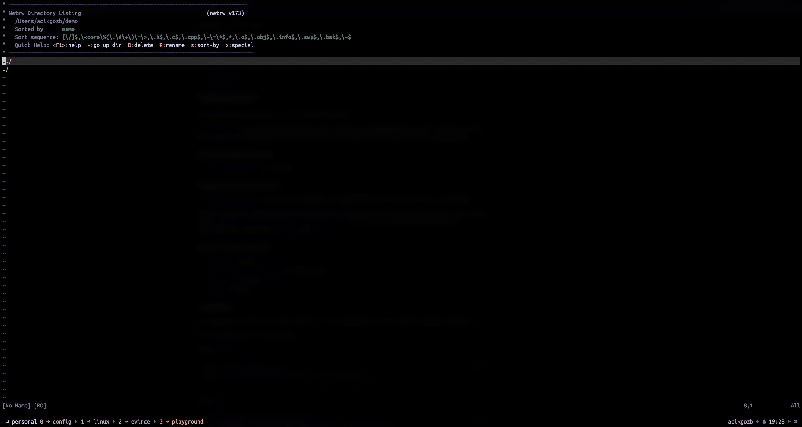

# tempgen.nvim

<!--toc:start-->

- [tempgen.nvim](#tempgennvim)
  - [What is Tempgen?](#what-is-tempgen)
  - [Demo](#demo)
  - [First, a Disclaimer](#first-a-disclaimer)
  - [Why Should You Use This Plugin?](#why-should-you-use-this-plugin)
  - [Installation](#installation)
  - [Configuration](#configuration)
  - [Usage](#usage)
  - [Contribution](#contribution)
  - [TODO](#todo)
  <!--toc:end-->

Your good ol' handy friend `cp` meets with `telescope.nvim`.

## What is Tempgen?

Tempgen allows people to scaffold their files as easy as fuzzy finding a file via `telescope.nvim`.

It allows users to store their "templates" wherever they want and then later on reference them inside files - based on their filetype.

## Demo



## First, a Disclaimer

I needed a tool which automates the scaffolding of certain configuration files (mainly README's, and YAML's). At that time, I decided to write `tempgen.nvim`, instead of searching online to find a better one - because my needs were pretty simple. Also, I wanted to dive into developing a Neovim plugin to see how is the experience like.

I do not know whether there is a tool which handles this in a better, broader way. If there is one, feel free to use that one instead.

This tool is not fully fledged out - there are still a couple of missing things, for more information regarding this, check the [TODO]() section.

## Why Should You Use This Plugin?

This plugin is only used for scaffolding files and nothing more, so it's perfect for scenarios where you don't want to write the whole "skeleton" of the file again, just to get started on your work.

Regarding the use cases, the only limit is your imagination, if you see a pattern between the projects you've been developing, you can extract the main idea (aka. create a template) and then automate your future work.

A couple of examples to start the train of thoughts:

- README's: You can have a basic template for all README's, or individual README's for different project types.
- Tool configuration files: For each tool you are using (mostly talking about DevOps tools here), you can create basic templates to kickstart your configurations.
- Language based configuration files (linting, project setup, etc.) - If there is no scaffolding available for these via CLI tools, you can create your own templates and reference them instead. Also, if you find yourself updating 3rd party CLI generated files a little bit every time you create them, you can automate this process as well.
- Project code itself: You can even create templates for certain structures you use in your projects. If you discovered a nice structure, and want to use it in your future projects? Automate it away!

This plugin is between code snippets and full fledged CLI project scaffolding - anything in between, that's the place for `tempgen.nvim`.

## Installation

You can install this plugin, like any other by using your favorite plugin manager.

This plugin depends on `nvim-telescope/telescope.nvim`.

Here's the installation for `lazy.nvim`:

```lua
{
    "acikgozb/tempgen.nvim",
    dependencies = {
        "nvim-telescope/telescope.nvim"
    },
    opts = {
        path = "path/to/your/templates"
    }
}
```

## Configuration

The confiugration itself is pretty easy and straightforward. Basically, you need to provide a path to your templates to allow `tempgen.nvim` to reference it later on in your Neovim buffer.

A couple of notes regarding the template path:

- The path can be pretty much anything you want. As long as your user has read permissions to your path, `tempgen.nvim` can pick it up.
- You can organize your template path however you want. Feel free to use nested directories to organize your templates.

Currently, the Telescope pane is not customizable, this plugin uses your base configuration for Telescope.

## Usage

The plugin comes with a command called `Tempgen`. In your current Neovim buffer, executing `:Tempgen` opens up Telescope, allowing you to see your templates.

You can fuzzy find your desired template through Telescope, and when you select it, your current buffer gets replaced by the selected template.

The main gist here is - your buffer's `filetype` should match with your template's **extension**. Otherwise it won't be seen on Telescope.

To check the filetype, you can execute `:lua print(vim.bo.filetype)`.

## Contribution

Originally, I did not created this repository to publicly share the plugin, I just wanted version control throughout the development. But later on, I thought it would be nice to share the experience and see whether people develop interest or not.

So I don't expect this plugin to have any contribution at all, but just in case, feel free to open an issue or even a PR if you encounter any errors or if you see some nice improvements.

## TODO

Here are the main points I found throughout my daily usage for a couple weeks:

1 - `filetype` - `extension` mapping: Originally I thought it would be nice to directly tie buffer filetype with templates' extensions, to organize the templates by their name. However in time, I realized this clutters the template names way too much than expected, so I'll implement a 1-1 file extension mapping instead.
2 - Tests: If you checked the code itself, it's pretty dead simple and does not have any tests. But it's a good practice to have tests to show the intention and as a self reference.
3 - `checkhealth` support: This one is needed for people to see whether the plugin is installed correctly or not.
4 - Code documentation: I would love to enable `:help` for this plugin, to have the documentation directly inside Neovim.
